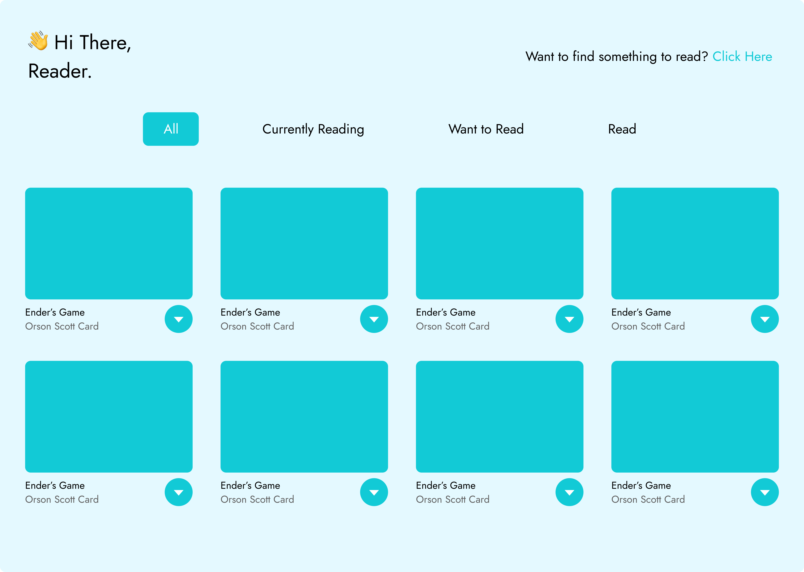

# My Reads

This is the first project submitted to Udacity React Nanodegree and this project focuses on basic state management techniques in react.

## What i learnt?

- [x] ES6 Fundamentals
- [x] UI Rendering
- [x] Props
- [x] Functional and Class Components
- [x] State Management
- [x] Life cycle events
- [x] React Router Basics

## Features

- 🌟 Customized Styles using CSS
- 🔥 Highly-Reactive UI
- 💡 Ready made components
- 🗺️ Routing using React Router
- 📘 Add Books to your reading list
- 📑 Update your reading list

## Installation

1. To Start with download node on your pc from its official site.
2. Install the dependencies

```
    npm install
```

3. Run the app

```
    npm start
```

4. See live in your local machine [here](http://localhost:3000/).

## Screenshots

Here's a quick overview of my project



## Deploy

You can easily deploy your site using netlify and here are the steps
